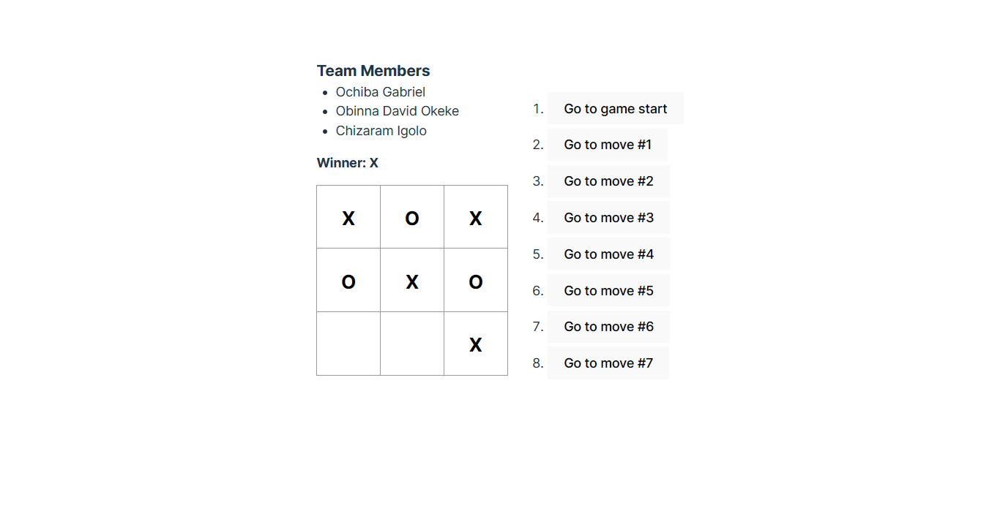

# Tic-Tac-Toe Game - Collaborative Coding using React + Vite

This application is a Tic-Tac-Toe game that allows 2 players to fill in squares with X's and O's until a winner emerges.

## Team Members

- Ochiba Gabriel
- Obinna David Okeke
- Chizaram Igolo

## To run

- Clone with `git clone https://github.com/o-david/tic-tac-toe.git`
- `cd` into folder
- Install all dependencies with `npm install`
- Start application with `npm run dev` or `ng serve` and navigate to `http://127.0.0.1:5173/` or the specified address in your browser.

## Screenshots

## Product Specification

A Tic-Tac-Toe game application that:

- Allows two (2) users to take turns playing.
- Keeps track of previous moves.
- Determines the winner when there is a win position.

### User Stories

As derived from the requirements given in the activity:

- As a user, I want click on an empty square on the Tic-Tac-Toe board to fill it with a 'X' or 'O'.
- As a user, I want to see whose turn it is to play next in a status message above the board.
- As a user, I want to see the winner displayed in a status message above the board if there is a winner.
- As a user, I want to see the history of the previous moves of both players on a list.
- As a user, I want to click on an item on the history list to go back or forward in the moves history.

## Skills We demonstrated

- Proficiency with React
- Proficiency with HTML and CSS
- Using ES6 JavaScript
- Proficiency with GitHub Project Board, Issue Management and Pull Requests
- Team Organization using Scrum Methodology

## Stack

- React
- JavaScript
- HTML
- CSS
